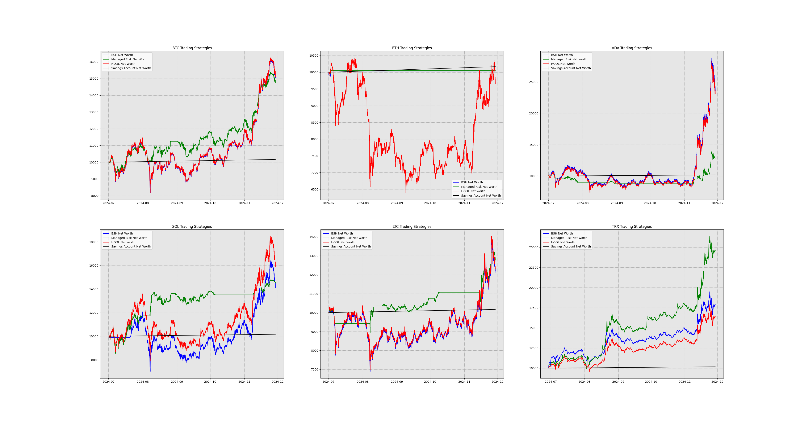
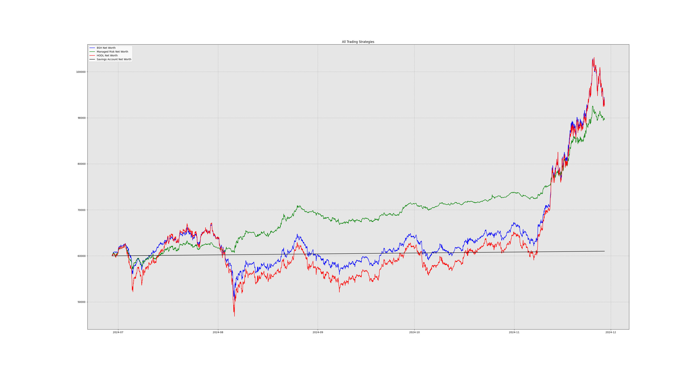

<!-- PROJECT LOGO -->
<br />
<p align="center">
  <a href="https://github.com/jtcass01/Pavlov">
    
  </a>

  <h3 align="center">Pavlov</h3>

  <p align="center">
    A financial asset trading agent.
    <br />
    <a href="https://github.com/jtcass01/Pavlov"><strong>Explore the docs �</strong></a>
    <br />
    <br />
    <a href="https://github.com/jtcass01/Pavlov/issues">Report Bug</a>
    �
    <a href="https://github.com/jtcass01/Pavlov/issues">Request Feature</a>
  </p>
</p>

<!-- TABLE OF CONTENTS -->
<details open="open">
  <summary><h2 style="display: inline-block">Table of Contents</h2></summary>
  <ol>
    <li>
      <a href="#getting-started">Getting Started</a>
      <ul>
        <li><a href="#prerequisites">Prerequisites</a></li>
        <li><a href="#installation">Installation</a></li>
      </ul>
    </li>
    <li><a href="#usage">Usage</a></li>
    <li><a href="#contributing">Contributing</a></li>
    <li><a href="#license">License</a></li>
    <li><a href="#contact">Contact</a></li>
  </ol>
</details>

## Getting Started

To get a local copy up and running, follow these simple steps.

### Installation
Download the Pavlov source code from [here](https://github.com/jtcass01/Pavlov) or using the following git system call.
```bash
git clone https://github.com/jtcass01/Pavlov.git
```

Locate the Pavlov directory.  Create a virtual environment and install the required packages. This has only been tested for Python 3.10.
```bash
python3.10 -m venv pavlov-venv
. pavlov-venv/bin/activate # for linux 
pavlov-venv\Scripts\activate # for windows
```

## Usage

### Downloading data
```bash
python data_generation/crypto/generate_crypto_data.py
```

### Training models
```bash
python pavlov.py
```

## Some Results
To generate your own results, download the data and train the models using the functions: single_security_tests and single_security_risk_tests. I may update this repo to be more user friendly one day but for now it is a bit of a sandbox.
<!-- Add a picture -->





<!-- CONTRIBUTING -->
## Contributing

Contributions are what make the open source community such an amazing place to be learn, inspire, and create. Any contributions you make are **greatly appreciated**.

1. Fork the Project
2. Create your Feature Branch (`git checkout -b feature/AmazingFeature`)
3. Commit your Changes (`git commit -m 'Add some AmazingFeature'`)
4. Push to the Branch (`git push origin feature/AmazingFeature`)
5. Open a Pull Request

## Future Work
I will likely deploy these agents on a decentralized exchange for a cryptocurrency that has low transaction cost. Right now, I am thinking the minswap exchange on the Cardano network may be a good place to start. I may develop this in private though for obvious reasons.

<!-- LICENSE -->
## License

Distributed under the GPL-3.0 License. See `LICENSE` for more information.


<!-- CONTACT -->
## Contact

Jacob Taylor Cassady - jacobtaylorcassady@outlook.com

Project Link: [https://github.com/jtcass01/Pavlov](https://github.com/jtcass01/Pavlov)
